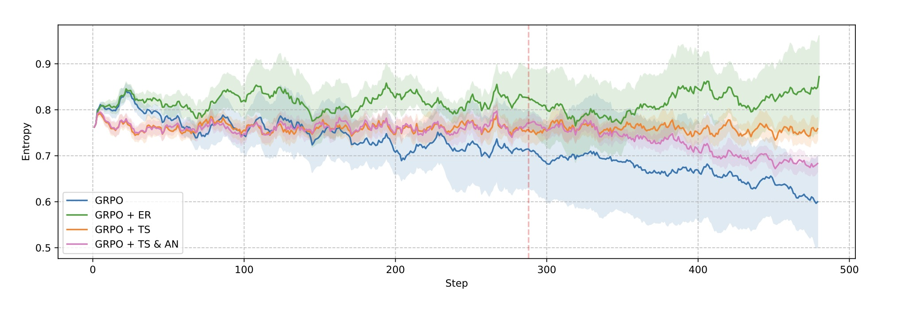
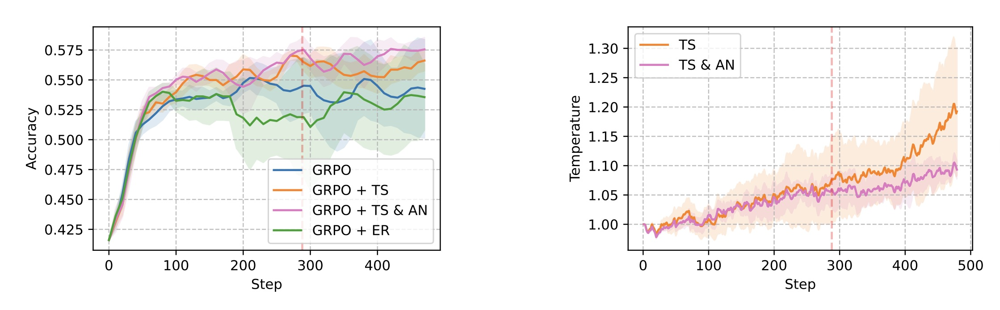
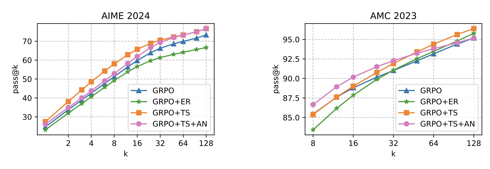
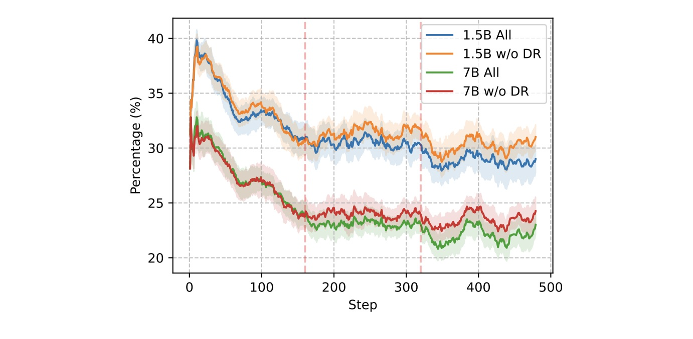
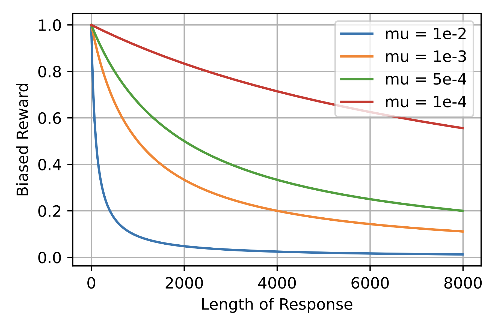
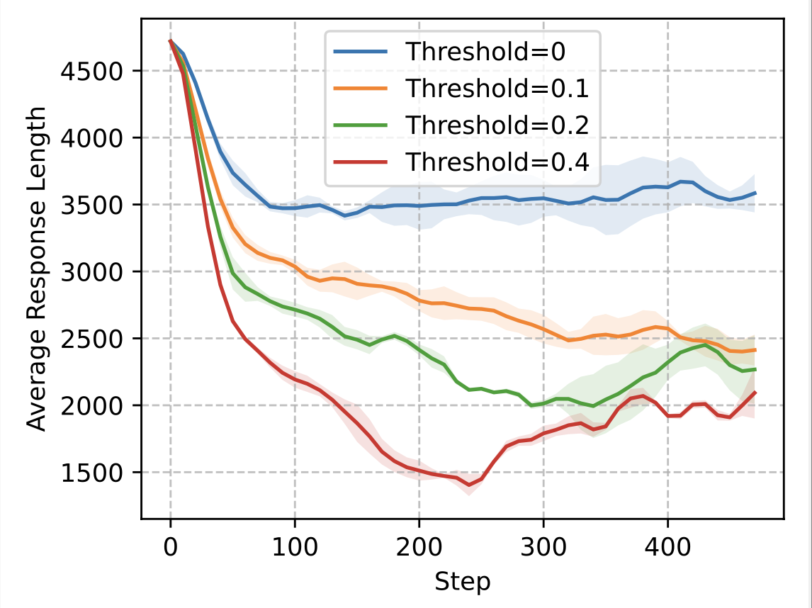
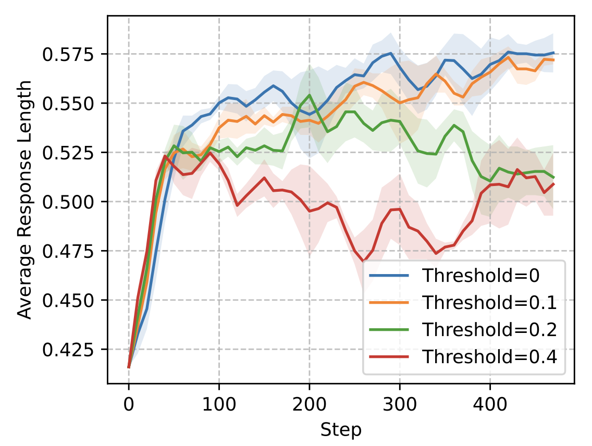

# E3-RL4LLMs
[paper](https://arxiv.org/abs/2505.18573)
```
@article{liao2025enhancing,
  title={Enhancing Efficiency and Exploration in Reinforcement Learning for LLMs},
  author={Liao, Mengqi and Xi, Xiangyu and Chen, Ruinian and Leng, Jia and Hu, Yangen and Zeng, Ke and Liu, Shuai and Wan, Huaiyu},
  journal={arXiv preprint arXiv:2505.18573},
  year={2025}
}
```

## Introduction
We enhance the training efficiency of RL by introducing a dynamic rollout 
budget allocation mechanism. 
For simple questions that the model can answer proficiently, 
we reduce their rollout budget, as performing reinforcement learning on such 
problems yields minimal gains. The saved rollout budget is reallocated to 
more challenging problems, thereby increasing the likelihood of 
obtaining correct answers. 

Additionally, to promote exploration without introducing harmful gradients, 
we propose a temperature scheduler that dynamically adjusts the temperature to maintain 
a stable policy entropy level, thereby enabling more extensive exploration during
training.  An annealing mechanism is further integrated to effectively balance 
exploration and exploitation.

## Main Results


As illustrated in the figure, the yellow curve represents the change in entropy during training when employing temperature scheduling, the blue curve corresponds to the use of GRPO alone, the green curve reflects the application of the entropy augmentation rule, and the pink curve indicates the combination with annealing. Our temperature scheduling method effectively maintains the entropy of the policy at a stable level throughout the training process.



The variation of accuracy on the validation set and the corresponding changes in temperature during the training process.



Pass@k on AIME24 and AMC23.
<p align="center">
  
</p>


The default rollout is set to 8, and the curves in the figure represent the proportion of completely incorrect cases. When employing dynamic rollout budget allocation, with the maximum rollout increased by 4, the proportion of completely incorrect cases is reduced by approximately 2%.

## Additional Features

Although not mentioned in the paper, our library supports length control. Specifically, we add a length-based bias to the rewards of correct rollouts for the bottom \(p\%\) of questions ranked by difficulty (simple questions): 

$$b= \frac{\mu \cdot l}{1+\mu\cdot l}$$

$$r=1-b$$

<p align="center">
  
</p>

shorter correct rollouts receive higher rewards. The experimental results are as follows:

<p align="center">
  
  
</p>

When the threshold is set to 0.1 (applying the reward bias to 10\% of the prompts), the performance is comparable to the case without applying the length bias, but the average length is reduced by approximately 40\%.

To enable this feature, the following parameters can be added:


```
# mu
algorithm.penalty_coeff = 0.001 
algorithm.penalty_threshold = 0.1
```

## Quick Start

Install VeRL. We modified parts of the code, 
specifically those related to the scoring function.

```shell
cd ./verl
pip install -e .
```


Train
```shell
bash ./scripts/train.sh
```

Inference
```shell
bash ./scripts/infer.sh
```

Evaluation (Accuracy)

```shell
python ./e3/main_eval.py
```

Metrics (pass@k)
```shell
python ./e3/main_metric.py
```
